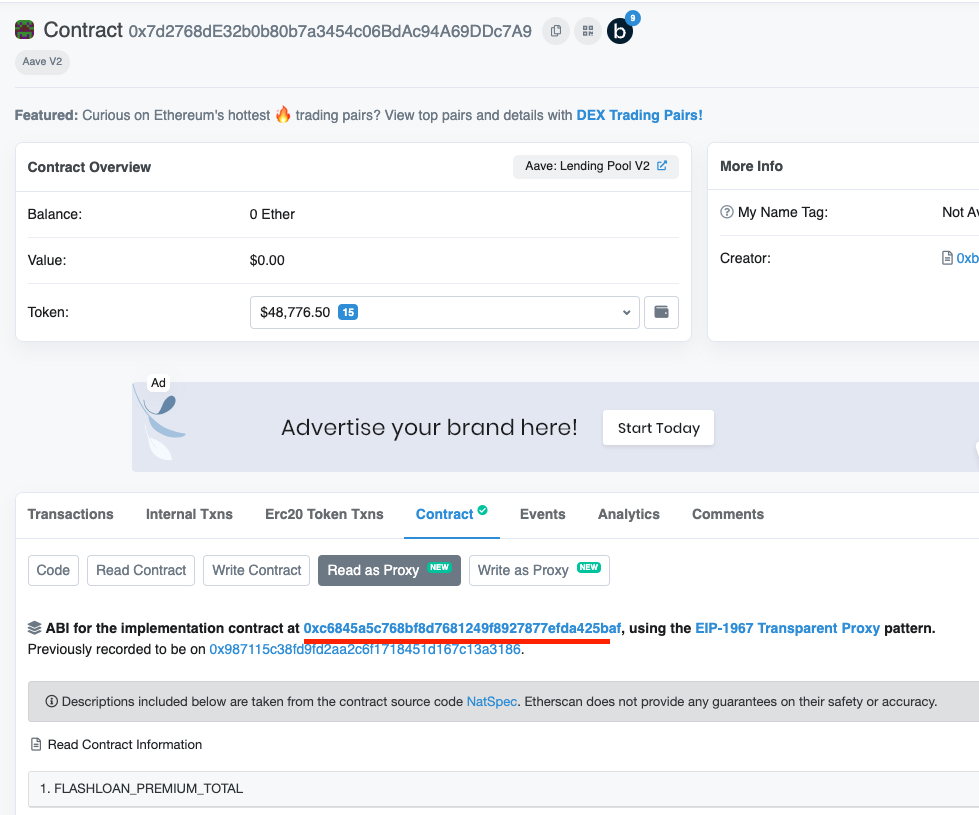

# Mapping

This document contains some information about issues you may run into, or tips and tricks that may help you when working on mappings.

## Common Issues

### Proxy

Some protocols use proxy contracts for upgradeability. Note that when handling proxy contracts, you should use the ABI of the implementation contract instead of the proxy contract. For example, Aave v2 uses a proxy for its Lending Pool contract: https://etherscan.io/address/0x7d2768de32b0b80b7a3454c06bdac94a69ddc7a9#code

You should navigate to the implementation contract first (Contract -> Read as Proxy -> Address underlined in red) and use the ABI there:

### Price Oracles

### Snapshots

If no event occurred throughout the duration of a snapshot, you can skip that snapshot.

## Testing

### Matchstick

You can leverage the Matchstick unit testing framework to better debug/test your code:

https://github.com/LimeChain/matchstick/blob/main/README.md

## Debugging

### Indexing Status

You can check the indexing status of your subgraph and surface indexing errors that you may encounter along the way here: https://thegraph.com/docs/en/developer/quick-start/#5-check-your-logs

## Known Issues

Here are some known issues with subgraph tooling that you may run into:

- Using a `derivedFrom` field in the graph code gives no compile time issues but fails when the graph syncs with error `unexpected null	wasm` ([Github Issue](https://iboxshare.com/graphprotocol/graph-ts/issues/219))
